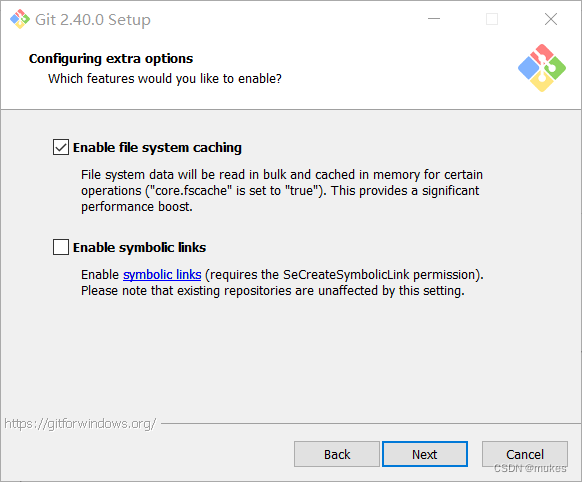

#  Git安装详细教程

## 1.下载安装包
官方下载地址：https://git-scm.com/  
单Windows版本下载地址：https://gitforwindows.org/  
阿里镜像地址：https://registry.npmmirror.com/binary.html?path=git-for-windows/

## 2.安装文件
前面都选择默认下一步，安装路径可以自定义，最好不要有英文，以免报错  

### 2.1 组件安装
遇到以下界面根据图示勾选，然后继续下一步  

### 2.2 默认编辑器
这里默认选用`Vim`，然后下一步   

### 2.3 默认分支名称设置
这里根据情况自行选择，第一个选项默认git新建分支为master，第二个默认是main也可以自定义  

>第二个选项下面有个 NEW！ ，说很多团队已经重命名他们的默认主干名为 main . 这是因为2020 年非裔男子乔治·弗洛伊德因白人警察暴力执法惨死而掀起的 Black Lives Matter(黑人的命也是命)运动，很多人认为 master 不尊重黑人，呼吁改为 main.

### 2.4 调整path环境变量
第一种是`只能通过Git Bash来使用Git`  
第二种是`支持第三方如：cmd、powershell等运用Git`，推荐使用这种模式  
第三种是`从命令提示符使用Git和可选的Unix工具`，可以忽略  

### 2.5 选择SSH执行文件
默认选择第一个即可  

### 2.6 选择HTTPS后端传输
普通用户，只用来访问Github、Gitlab等网站的话，就选第一项即可  

### 2.7 配置行尾符号转换
Windows用户安装选择第一项默认即可  

### 2.8 配置终端模拟器与Git Bash一起使用
默认选择第一种即可  

### 2.9 选择默认的“git pull”行为
第一种`git pull=git fetch+git merge`，建议选择这种  
第二种`git pull=git fetch+git rebase`，这种风险较大，建议资深选手选择使用  
第三种`git pull=git fetch`，不确定是不是这个意思，纯属猜测  

### 2.10 选择凭证
选择默认第一项即可  

### 2.11 配置额外选项
勾选第一个，不勾选第二个  

>* 第一个是`启用文件系统缓存`就是将批量读取文件系统数据并将其缓存在内存中以进行某些操作，可以显著提升性能。这个选项默认开启。  
>* 第二个是`启用符号链接` ，符号链接是一类特殊的文件， 其包含有一条以绝对路径或者相对路径的形式指向其它文件或者目录的引用，类似于 Windows 的快捷方式，不完全等同 类Unix（如 Linux） 下的 符号链接。因为该功能的支持需要一些条件，所以默认不开启。

### 2.12 配置实验性选项
都是实验性功能，建议都不勾选  
